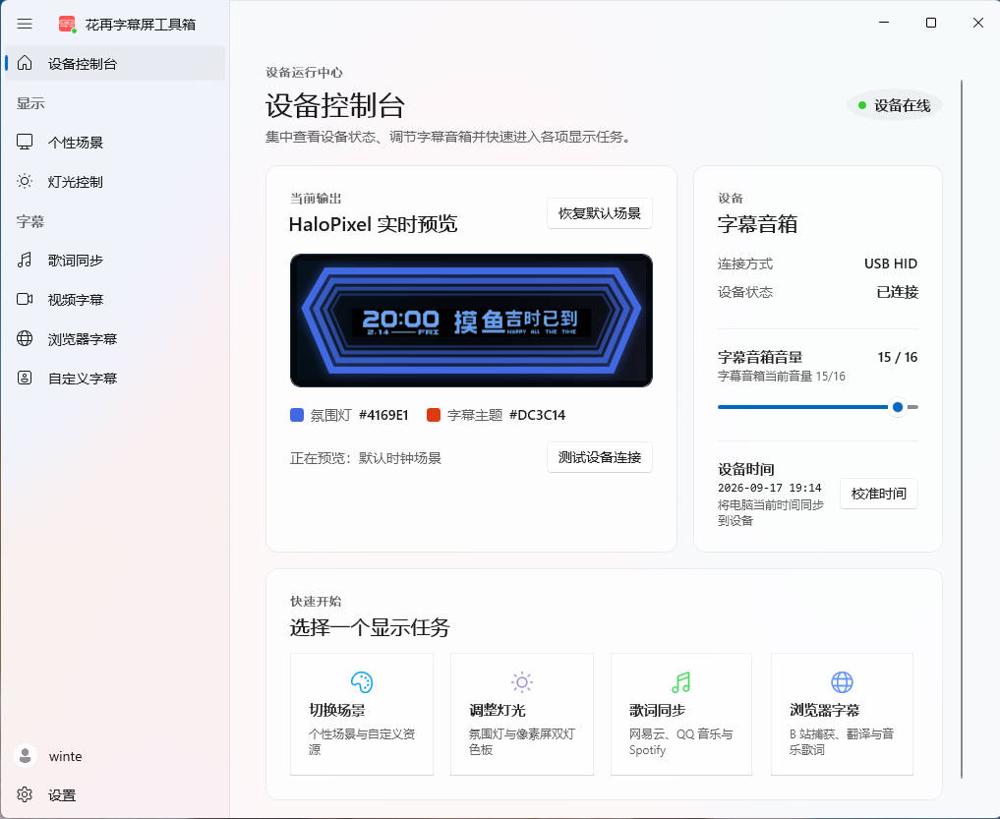
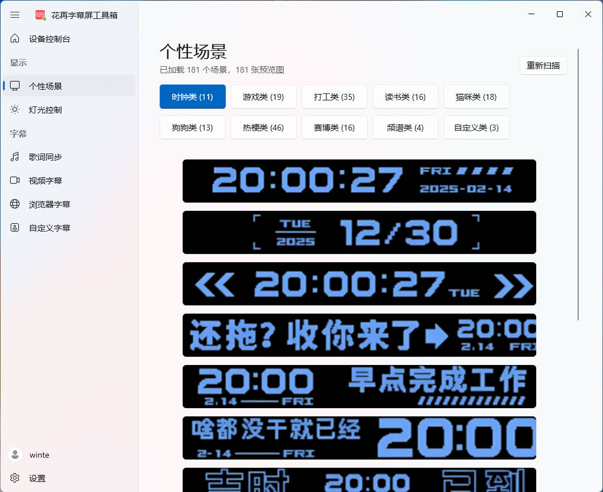
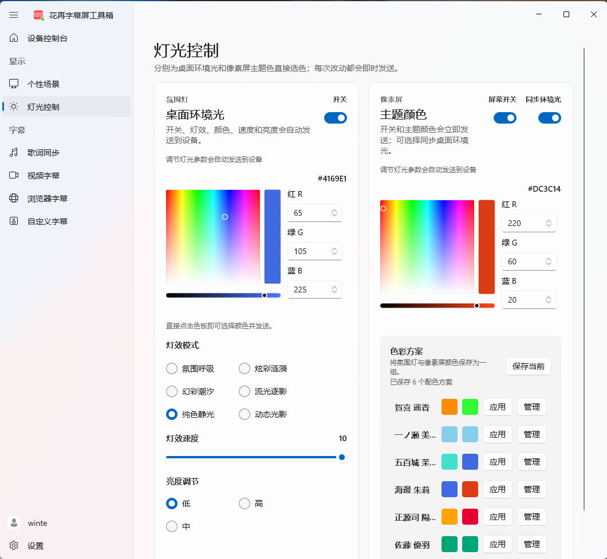
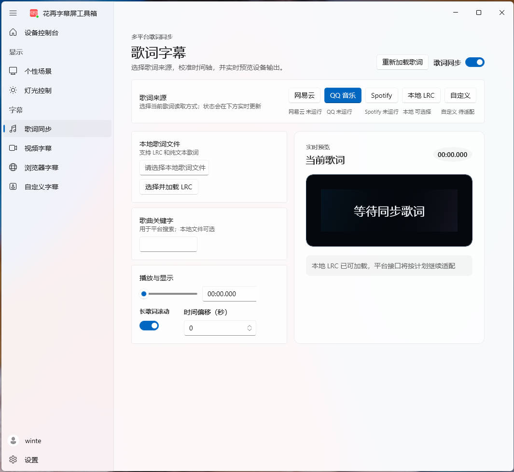
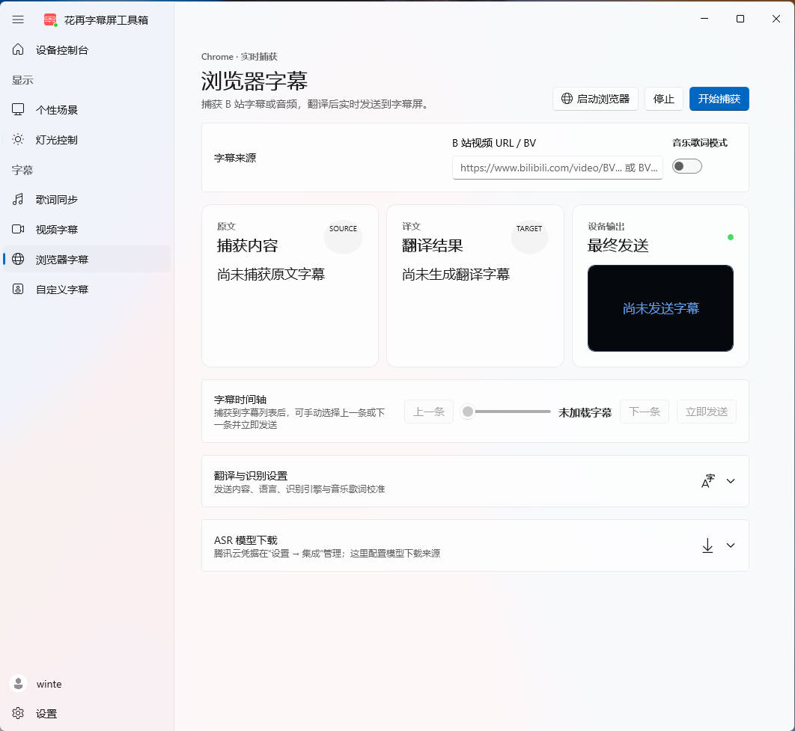
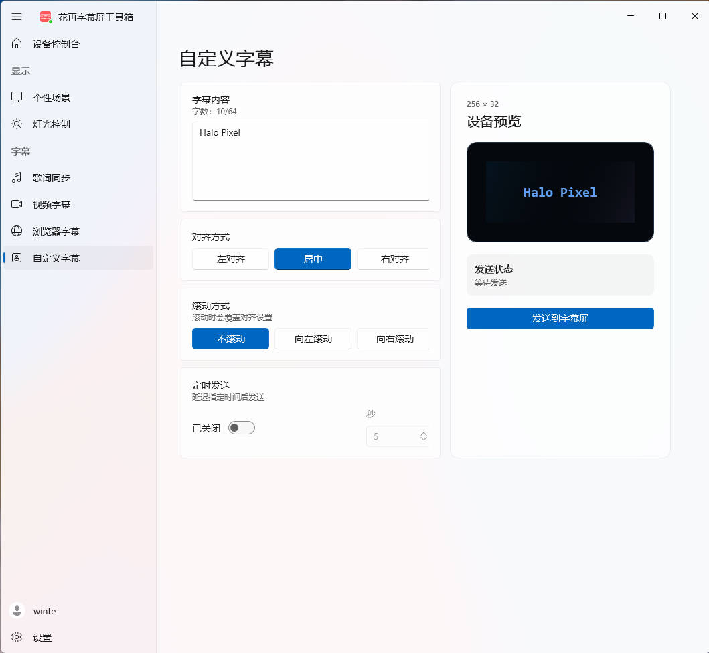

<div align="center">
  
  <h1>HaloPixelToolBox</h1>
  <p>花再 / HaloPixel 字幕屏与音箱像素屏的 Windows 桌面控制工具箱</p>
  <p>
    <a href="https://github.com/AlexandreShogenji/HaloPixelToolBox/releases/latest"><strong>下载最新版</strong></a>
    · <a href="https://github.com/AlexandreShogenji/HaloPixelToolBox/issues">问题反馈</a>
    · <a href="LICENSE.txt">MIT License</a>
  </p>
  <p>
    
    
    
  </p>
</div>

当前稳定版为 **v3.0.1**。它把设备状态、字幕音箱音量、设备校时、场景入口和灯光控制集中到一套 WinUI 3 界面中，并通过 USB HID 直接与兼容设备通信。v3.0.1 修复了 v3.0.0 安装器在部分目录中留下临时文件、以及漏装嵌套资源后应用无法启动的问题。



## v3.0 功能亮点

- **设备控制台**：显示 USB HID 连接状态、当前输出预览和常用任务入口；启动后即可读取并调整 0–16 级字幕音箱音量。
- **经过实机验证的设备控制**：支持设备时间校准、像素屏开关和氛围灯开关，写入后会读取设备响应确认状态。
- **灯光与配色**：分别设置氛围灯、像素屏主题色、灯效、速度和亮度，并保存常用配色方案。
- **多来源歌词**：支持网易云音乐、QQ 音乐、Spotify 和本地 LRC，包含播放进度同步、偏移校准和长句分段显示。
- **多种字幕链路**：支持 PotPlayer 本地字幕、B 站浏览器字幕与音频识别、腾讯云翻译，以及即时自定义字幕。
- **手动更新检查**：只有在“设置 → 检查 GitHub 更新”中点击按钮时才访问 GitHub Releases；软件启动时不会自动检查。

## 功能界面

### 个性场景

按类别浏览内置场景并一键发送到像素屏。工具箱也支持导入 1–5 帧、每帧 256×32 的 PNG/JPG 自定义资源。



### 灯光控制

氛围灯和像素屏可以独立开关与选色。页面同时提供灯效、速度、亮度、环境光同步和配色方案管理。



### 歌词同步

在网易云音乐、QQ 音乐、Spotify 与本地 LRC 之间选择歌词来源，按播放器时间轴持续输出到设备，并在界面中预览当前歌词。



### 浏览器字幕

捕获 B 站字幕或音频，根据需要执行翻译或 ASR 识别，再按播放进度把结果发送到字幕屏。ASR 支持 SenseVoice 与 Whisper 系列模型。



### 自定义字幕

直接编辑要显示的文字，选择左对齐、居中、右对齐或滚动方式；发送前可在 256×32 设备预览中检查效果。



视频字幕页可跟随 PotPlayer 的字幕输出文件实时同步，支持 TXT、SRT、WebVTT、ASS、SSA、LRC 和 SUB。

## 下载与安装

1. 打开 [GitHub Releases](https://github.com/AlexandreShogenji/HaloPixelToolBox/releases/latest)。
2. 普通用户下载 `HaloPixelToolBox-v3.0.1-installer-win-x64.exe`；无需安装时可使用 `HaloPixelToolBox-v3.0.1-win-x64.zip` 便携包。
3. 使用 USB 连接兼容的 HaloPixel / 花再设备，再启动工具箱。

系统要求：Windows 10 1809 或更高版本、x64、[.NET 8 Desktop Runtime](https://dotnet.microsoft.com/download/dotnet/8.0)。当前安装器未做代码签名，Windows 可能显示“未知发布者”；可用 Release 附带的 `SHA256SUMS.txt` 核对下载文件。

## 首次使用

1. 在设备控制台确认右上角显示“设备在线”，移动音量滑块测试 HID 控制链路。
2. 在“个性场景”中设置日常场景；歌词、视频或浏览器字幕停止后会恢复当前场景。
3. 按需配置歌词来源、PotPlayer 字幕文件，或在“设置”中保存腾讯云翻译凭据。凭据只保存在本机且不会在界面中回显。

浏览器 ASR 首次使用时需要下载模型；模型会保存在独立缓存目录，不会被普通缓存清理删除。网易云桌面歌词读取依赖受支持的客户端版本。

## 更新

工具箱不会在启动时联网检查版本。需要更新时，请打开“设置 → 下载 & 更新”，点击“检查 GitHub 更新”。检测到新版本后，“下载更新”会在默认浏览器中打开对应的 x64 安装器；如果该版本没有安装器附件，则打开 Release 页面。

## 开发与构建

仓库使用 .NET 8、WinUI 3 和 WPF。`Directory.Build.props` 是产品版本的主来源，`eng/Set-Version.ps1` 会同步四段程序集版本和 MSIX manifest 版本。

```powershell
# 设置下一版本
powershell -ExecutionPolicy Bypass -File eng/Set-Version.ps1 -Version 3.0.1

# 构建主程序与核心库
dotnet build HaloPixelToolBox.sln -c Release -p:Platform=x64

# 生成安装器、便携 ZIP 与 SHA256SUMS.txt；版本默认从 Directory.Build.props 读取
powershell -ExecutionPolicy Bypass -File eng/Build-Release.ps1 -Platform x64 -Runtime win-x64
```

最终发布文件位于 `artifacts/release/v<版本号>/`；打包时生成的展开目录和嵌入 ZIP 会自动清理。详细贡献、Git 与发布约定见 [CONTRIBUTING.md](CONTRIBUTING.md)。

## 致谢与许可

项目基于 XFEstudio 的开源工作继续开发，由 Alexandre 维护。源码按 [MIT License](LICENSE.txt) 发布。
