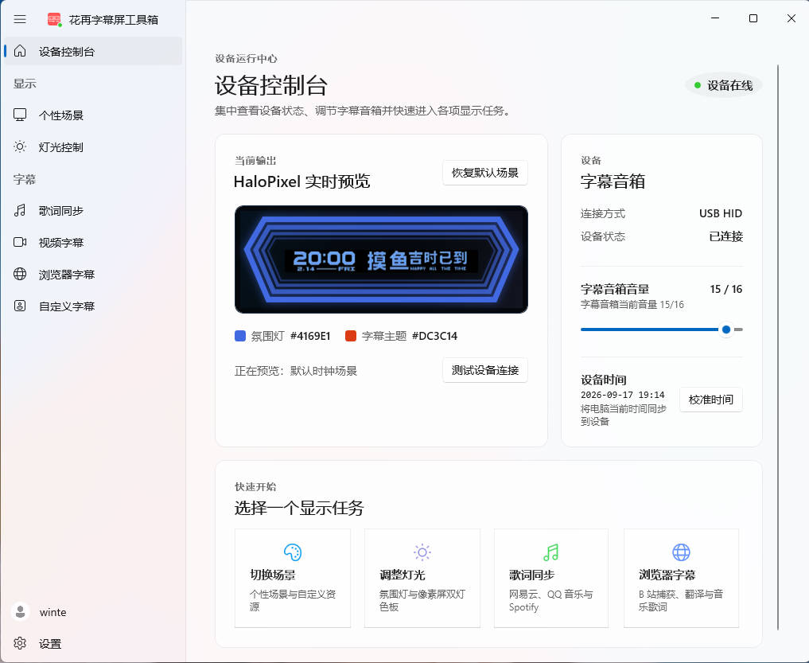
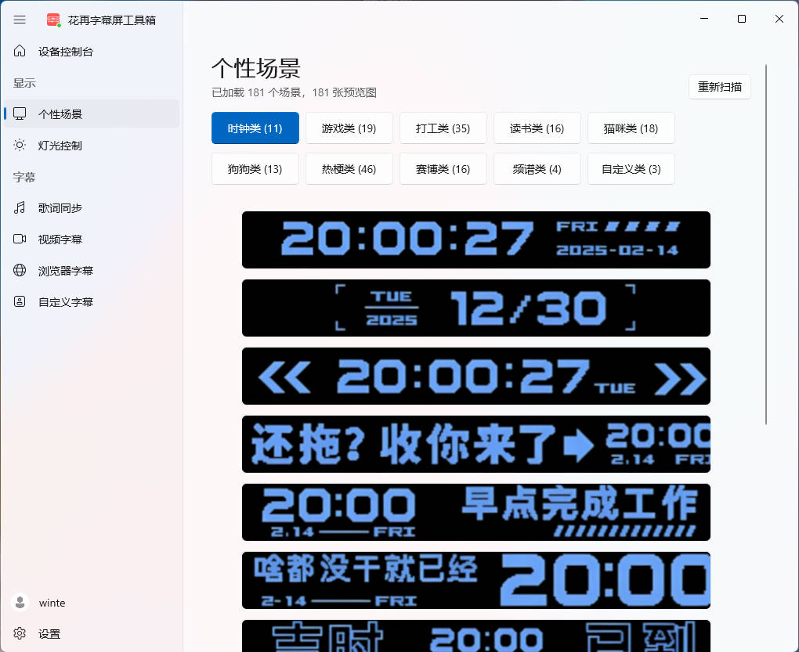
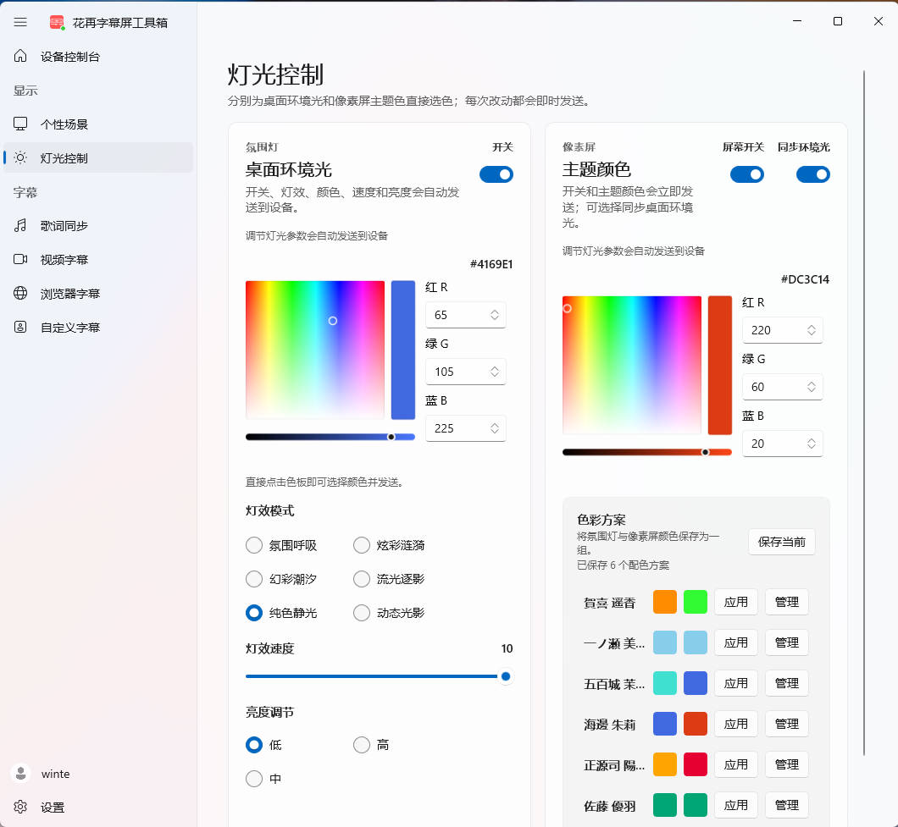
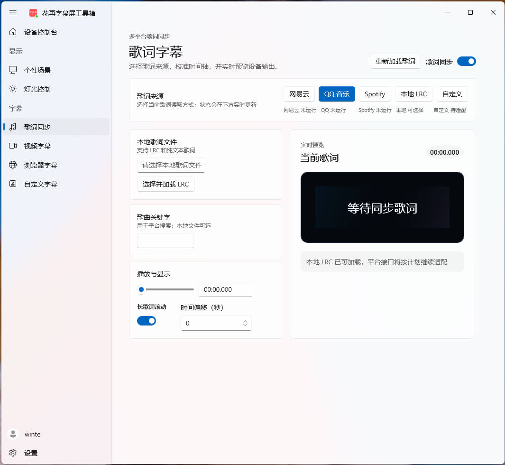
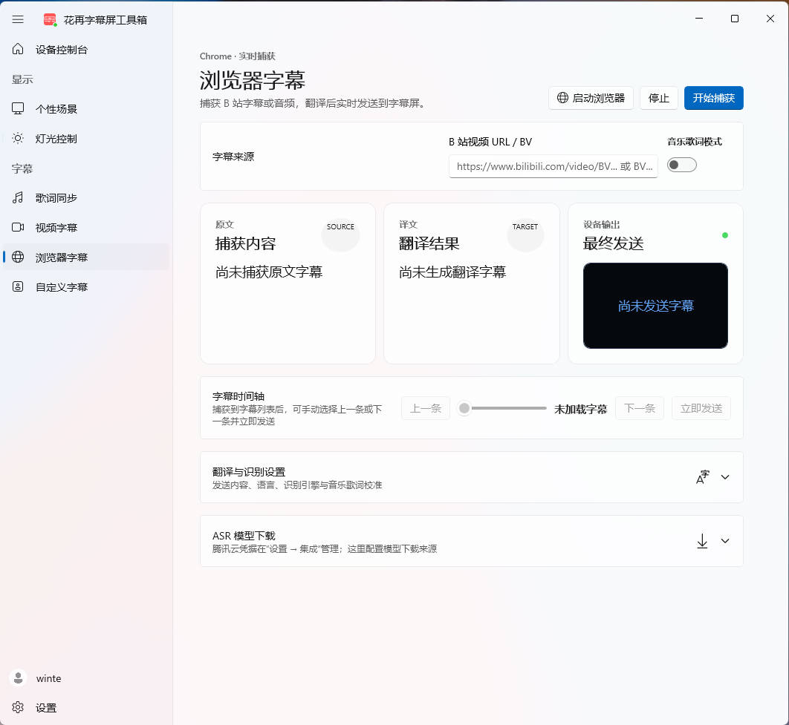
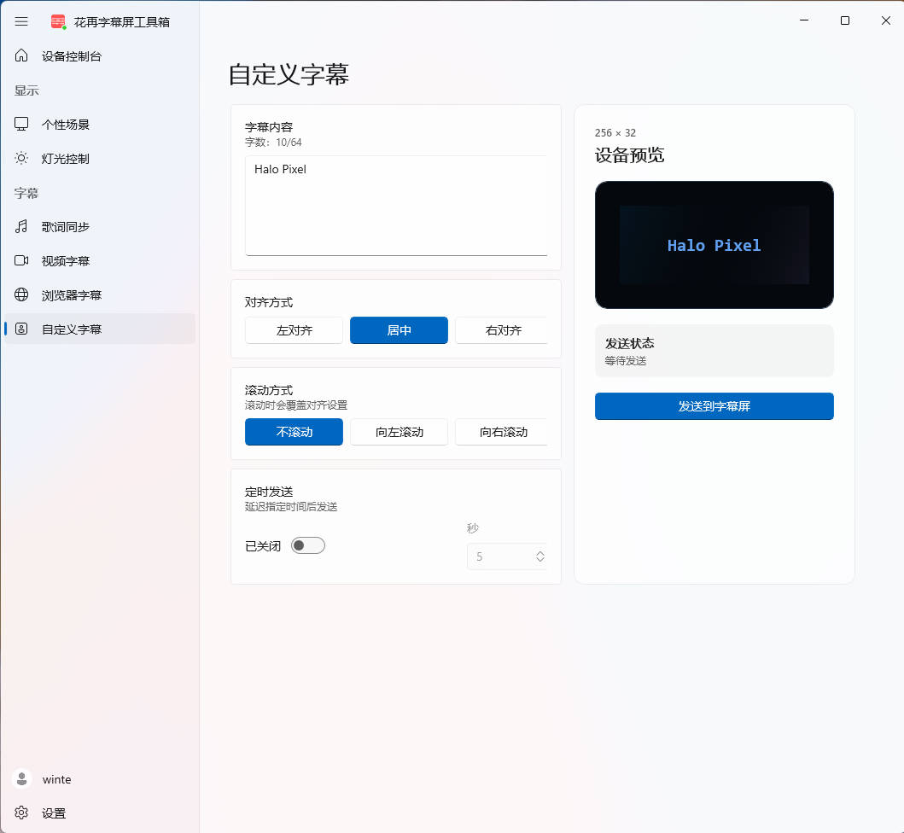

<div align="center">
  
  <h1>HaloPixelToolBox</h1>
  <p>花再 / HaloPixel 字幕屏与音箱像素屏的 Windows 桌面控制工具箱</p>
  <p>
    <a href="https://github.com/AlexandreShogenji/HaloPixelToolBox/releases/latest"><strong>下载最新版</strong></a>
    · <a href="https://github.com/AlexandreShogenji/HaloPixelToolBox/issues">问题反馈</a>
    · <a href="LICENSE.txt">MIT License</a>
  </p>
  <p>
    
    
    
  </p>
</div>

当前版本为 **v3.2.0**。它把设备状态、字幕音箱音量、设备校时、场景入口和灯光控制集中到一套 WinUI 3 界面中，并通过 USB HID 直接与兼容设备通信。



## v3.2.0 改进

- 新增 DSH 会话页、聊天输入与会话管理，音箱设备口令复用固定控制会话。
- 接通本地语音唤醒、设备控制与普通 DSH 任务创建、监控、问答和授权链路；支持后台断线恢复，失败时不自动重发。
- 设备插件扩展到 25 个 Tool，区分氛围灯效、配色预设与像素场景，并支持歌词、自定义字幕、默认场景与自动关灯设置。
- 新增 256×32 自定义画板、电脑熄屏和每日时间段自动关灯，改善窗口缩放与设置展开布局。
- 整理源码、回归测试和发布脚本，提供统一测试入口。独立音效保留开发预览，后续开发暂缓。

## v3.0 功能亮点

- **设备控制台**：显示 USB HID 连接状态、当前输出预览和常用任务入口；启动后即可读取并调整 0–16 级字幕音箱音量。
- **经过实机验证的设备控制**：支持设备时间校准、像素屏开关和氛围灯开关，写入后会读取设备响应确认状态。
- **灯光与配色**：分别设置氛围灯、像素屏主题色、灯效、速度和亮度，保存常用配色方案；支持电脑熄屏或每天指定时段自动关闭灯光，并在条件结束后恢复原状态。
- **Agent 设备接口**：提供当前 Windows 用户可访问的本机命名管道，并附带 DeepSeek Harness Tool bundle；Agent 无需接触原始 HID 即可查询状态和控制设备。
- **多来源歌词**：支持网易云音乐、QQ 音乐、Spotify 和本地 LRC，包含播放进度同步、偏移校准和长句分段显示。
- **多种字幕链路**：支持 PotPlayer 本地字幕、B 站浏览器字幕与音频识别、腾讯云翻译，以及即时自定义字幕。
- **手动更新检查**：只有在“设置 → 检查 GitHub 更新”中点击按钮时才访问 GitHub Releases；软件启动时不会自动检查。

## 功能界面

### 个性场景

按类别浏览内置场景并一键发送到像素屏。自定义区提供 256×32 像素画板，支持画笔、橡皮、1/2/4 像素笔刷、撤销、重做、清空和图片导入，可直接生成并发送单帧场景；也可导入 1–5 帧、每帧 256×32 的 PNG/JPG 生成动画资源。



### DeepSeek Harness 插件（开发预览）

独立音频工具随 0.7.0 插件加入，共 25 个 Tool。`get_pixelbar_audio_status` 读取播放设备、曲线预设、EQ 参数和组件就绪状态；`configure_pixelbar_audio` 调节音效开关、十段均衡器、前级增益、左右平衡或预设，也支持低音/中音/高音的相对增减；`set_pixelbar_audio_output` 仅在明确要求时切换 Windows 默认播放输出。音效与灯效、配色预设分开，未安装或未接入组件时返回未确认生效，并保留已保存曲线。插件更新后需要重新启动工具箱持有的 DSH Host 才会加载新工具。

[`integrations/deepseek-harness/halo-pixelbar-tools`](integrations/deepseek-harness/halo-pixelbar-tools) 的 0.7.0 版本提供 25 个设备 Tool，覆盖状态查询、灯光与像素屏开关、氛围灯效及速度、0–16 音量、独立音效与输出设备、时钟显示、恢复默认场景、自定义字幕、Spotify 歌词、自动关灯配置，以及单项或组合场景控制。氛围灯效指界面中的六种动画模式：氛围呼吸、幻彩潮汐、纯色静光、炫彩涟漪、流光逐影、动态光影；“换个氛围灯效”切换至下一个模式，“随机灯效”从其余模式选择，不改变当前配色、速度、亮度和开关。贺喜遥香等灯光预设是保存的氛围灯与像素屏配色，使用独立工具。“恢复默认场景 / 切换为默认场景”调用专用恢复工具，行为与界面按钮一致：恢复最近使用的个性场景，无记录时回退默认时钟；不查询一个名为默认的目录场景，也不切换氛围灯效。灯效、灯光预设与场景引用支持简繁体、别名、部分名称和中文序数；无法唯一判断时会返回候选而不执行。HaloPixelToolBox 继续独占设备协议，并通过仅限当前 Windows 用户的 `HaloPixelToolBox.DeviceControl.v1` 命名管道向插件提供结构化结果。安装和本地验证步骤见该目录 README。

氛围灯手动关闭或正在执行自动关灯时，切换灯效只保存新模式，不写灯效包或开启灯光；下次手动开启或自动关灯结束后恢复时使用新模式。灯效写入结果区分 `writeSent` 和 `localProfile`，不把本地保存或发送成功当作设备读回确认。

软件的“设置 → 集成 → DeepSeek Harness”可配置 DSH 启动命令、`DSH_HOME`、Profile 和检测/桥接超时，并可自动检测安装、测试 DSH、安装或更新内置插件以及验证设备桥接。升级时会先移除旧插件，再从 `DSH_HOME` 内的版本缓存安装并核对实际版本；`DSH_HOME/settings.yaml` 仍由 DSH 自身管理。

### DSH 会话（开发预览）

导航中的“DSH 会话”使用设置页保存的 DSH 启动程序、数据目录与 Web Profile。点击“启动并连接 DSH”后，会优先连接同一数据目录的本机会话桥接；若未发现桥接，则启动一份由工具箱持有的 DSH Host，通过附加模块读取已有会话。离开页面不会停止 Host，退出工具箱时只结束工具箱自己启动的进程。

页面左侧显示聊天气泡，右侧为精简的会话列表，支持按标题或工作目录搜索、加载更早记录，并在页面打开时每 8 秒后台刷新。已知更新时间且状态稳定的历史没有变化时跳过读取；运行中、状态未知或缺少更新时间的会话继续读取，手动刷新可强制更新。列表按会话 ID 更新，归类增加时保留已加载消息和展开状态。打开会话时自动显示最新消息；查看较早记录时保持位置，在底部阅读时跟随新消息和窗口缩放，普通正文点击不会暂停跟随。窄窗口在列表和详情之间切换。运行上下文、工具记录和长消息默认折叠为简短的一行，点击可查看原文；旧语音指令的重复提示包装也折叠保留。历史读取使用 DSH 官方 Session Controller，不恢复 Agent，也不发送命令；长记录会明确标注截断。切换数据目录或 Profile 会取消旧历史读取。

音箱设备口令使用固定的“音箱控制”会话，会话 ID 按数据目录与 Web Profile 独立保存，程序重启后继续复用。新版还限制同一 Windows 用户会话中跨目录启动多份工具箱，防止旧监听重复执行口令或覆盖配置。已确认属于设备控制的历史会话在列表中归到一个“音箱控制”入口，消息按时间合并显示；原始 DSH 会话和日志保留，归集历史不会发送给模型。选中其他会话后，可设置为音箱任务目标，供后续任务管理使用；这一选择不会把设备指令写进任意开发会话。运行状态仅代表当前连接的 Host；在其他 DSH 进程中的任务不会被推断为空闲，旧版 DSH 缺少运行状态字段时显示“状态未知”。

会话详情底部提供手动输入框，Enter 发送，Shift+Enter 换行，输入法确认候选词时不会发送。音箱控制入口与语音命令共用固定设备会话，其他会话把原文发送到当前选中的既有会话；发送后强制刷新历史。草稿按数据目录、Profile 和会话隔离保存于当前页面实例；提交被拒绝或结果尚未确认时保留草稿，不自动重发。服务明确拒绝的消息显示“未提交”，不将其伪装成已写入 DSH 的历史。固定设备会话恢复时沿用 DSH 记录的原始工作目录，因此从开发目录迁移至安装目录后仍可继续使用同一个会话。

会话列表中的“＋”可创建并命名普通会话，顶部“新建任务”用于创建带音箱监控的任务。详情右上角“···”提供重命名及按服务能力开放的归档/恢复。创建和改名直接使用官方 Controller，不消耗模型提示词。DSH 0.2 支持可恢复归档；0.1.5 缺少官方恢复接口，因此不提供归档操作。运行中的会话与固定音箱控制会话不能归档，列表菜单可筛选已归档会话并恢复。页面不提供永久删除操作。

会话桥接仅监听 `127.0.0.1`，使用随机令牌鉴权。已确认的会话分类通过原子写入缓存跨重启复用，按数据目录、Profile、分类规则与会话变更键隔离；缓存不保存消息正文、工具结果或令牌，损坏或不可写时回退重新分类。接口、兼容范围与模块测试见 [`halo-session-bridge`](integrations/deepseek-harness/halo-session-bridge)。

列表搜索只过滤会话入口，保留当前打开的聊天历史和输入草稿；即使没有匹配结果，仍可在当前会话继续编辑。清除搜索后恢复当前会话的列表高亮，点击另一条结果才切换会话。实际移除会话或切换数据目录、Profile 时才清除失效的详情。

### 音箱任务链路（开发预览）

展开“设置 → 集成 → DeepSeek Harness”，在“默认任务目录”保存任务根目录，初始为文档目录下的 `DSH任务`。会话页的“新建任务”可填写根目录、任务名和指令；每次在指定根目录下独占创建一个带时间和随机后缀的任务文件夹，使用普通 DSH Agent 会话执行，不复用设备控制 persona。提交只等待 DSH 接受确认，实际执行由后台监控，麦克风继续等待“花再花再”。当前任务的聊天输入也只等待接受确认，并在同一会话继续，避免重复建会话。其他普通会话的菜单可显式启用音箱监控。

语音可说“新建一个 DSH 任务”，此时立即创建独立任务目录和空闲普通会话，在列表显示“等待任务内容”，尚不调用模型。听到提示后直接说任务内容，或说“任务内容，读取项目并总结”，指令会提交到刚才建立的同一会话；也可一次说“新建 DSH 任务，任务内容：在工作目录创建一个说明文件”。会话页的“新建任务”同样允许先留空指令创建，再用聊天输入补充。指定路径时可使用“在 D:\任务目录 下新建任务，任务内容：……”；含空格的路径建议在界面输入。运行期间可说“查询当前任务状态”“朗读任务结果”“取消当前轮”“停止任务监控”，以及直接补充任务指令。说“任务列表”可听到普通任务的编号与名称，再说“切换任务到第二项”或完整名称；每页五项，可说“下一页任务”“上一页任务”。编号使用刚才播报的列表，切换任务只转移监控，不取消之前的真实任务。灯光、音量、歌词、时间和场景口令继续走固定设备会话；待回答期间，如需控制设备，明确加“设备”或“音箱控制”前缀。

任务创建支持“新建1个DSH任务”“创建一个DSH的会话任务”等识别结果。中间夹描述且意图不够明确的创建说法只准备草稿并提示“尚未创建”，询问具体任务；草稿的下一句可以直接说自然语言指令，不强制“任务内容”前缀。明确的新建口令在等待内容期间重复说，不重复建会话；“好的”“批准本次”等不会变成任务内容。只有明确识别的设备口令进入音箱控制会话，未选择普通任务时的 DSH 请求及不明确口令会先询问去向。语音创建成功后，会话页在默认音箱控制或此前跟随的任务上自动打开新任务；用户手动选中的其他会话保持不变，同一任务的状态轮询不会反复抢回选择。

运行、等待授权、等待回答、完成、失败和取消会显示到字幕屏。遇到问题时读出题号、问题、编号选项和回答方法，字幕按设备每条 55 字节上限分页显示，约每四秒翻页；状态或请求改变后停止旧提示。屏幕已关闭或正在自动关灯时保留关闭状态，仍在会话页显示进度。语音提示使用 Windows 已安装的中文女声在本机合成，不向在线语音服务发送问题和授权内容；音色可能与内置“我在”不同。合成结果使用有界临时缓存，播放前后清理录音缓冲，播完后直接进入回答收音；未开口超过等待时限会恢复唤醒，不选择默认答案。若中文语音组件不可用，会显示播报失败，字幕和界面仍可查看完整请求。

选择时可说“第一项”、准确名称或唯一的名称片段；多选可说“一和三”“全选”，随后也可说“加上第二项”“去掉第三项”。含糊、越界和否定表达不会自动提交。其他答案可说“我的答案是……”；纯文本题直接说内容即可。说“重听”“有哪些选项”“继续回答”会重新播报；说“修改上一题”“修改第一题”“重新回答”可调整草稿，语音选择会同步到界面。所有题回答完后先复述答案，明确说“确认提交”才通过 DSH 的问题回答接口发送。说“取消回答”只清空答案，仍保留等待中的任务。

授权会读出工具和请求理由，只绑定当前真实请求，明确说“批准本次”或“拒绝本次”；“好的”、普通聊天、历史日志和过期请求都不能授权。多个授权请求可以说“选择授权第二项”，听到该项内容后再作决定，不支持一句话批量批准。请求内容或所属任务变化时，旧提示和旧录音作废；界面已回答的问题不会因随后到达的语音再次提交。第一次继续既有任务前先读取真实状态，避免将问题答案误作新任务消息。

任务详情可切换多项待处理请求；问题提供可点击的单选、多选及自由文本，选项不会默认勾选，只有完整回答后才能明确提交。关闭弹窗、提交失败或临时断线时，同一请求的答案草稿保留在内存；恢复后仍需人工提交。已处理或内容变化的请求不会复用旧草稿，离开页面或切换任务、数据目录、Profile 会清理草稿。答复会核对原始问题、选项或授权理由，旧内容不能授权新请求；切换任务后旧错误也不会盖住当前任务状态。

取消仅请求 DSH 取消当前执行轮，保留会话及排队消息；停止监控释放音箱对待答请求的接管，不取消真实任务。监控身份按 DSH_HOME 与 Profile 保存，重连只恢复监控，不重发原任务；提交结果未确认时保留已有会话和目录供核对。任务运行和提示反馈需工具箱保持运行；退出工具箱会结束它持有的 DSH Host。桥接对当前版本缺少的能力明确报告不支持，不模拟授权或完成。

任务监控独立于会话页面运行。断线后按退避间隔只读查找同一数据目录与 Profile 下仍在运行的 Host，重新接管原任务会话并继续查询状态，不新建会话、不重发任务；服务已退出时保持“任务状态暂不可用”，需要显式启动服务。断线与恢复都刷新字幕，恢复同一个待答请求或未变化的完成状态时不重复播放提示音，多问题交互保留已收集答案并继续下一道未答问题。界面与麦克风同时回答同一请求时只允许一次进入 DSH，未确认提交不会显示为已经执行。停止监控即使未收到远端释放确认，也会停止本地轮询并清除音箱目标和自动恢复记录，明确显示未确认原因；不会取消真实任务。

### 语音 Agent（实验性）

展开“设置 → 集成 → 语音 Agent”可配置语音闭环；它与“DeepSeek Harness”“腾讯云翻译”并列，默认折叠并在摘要显示状态。PixelBar USB 麦克风在本机持续等待“花再花再”，唤醒后播放内置“我在”提示音，采集并识别一条中文指令，立即回复“收到”，再交给共享的 DSH Web Host 中的“音箱控制”会话执行。启用监听期间持续读取麦克风，内存队列只保留最新 1 秒；播放提示音和执行 DSH 时暂停识别，阶段切换时丢弃旧音频及跨阶段的半块数据，减少设备重开等待和回声混入。监听启动时并行加载本地模型和准备会话服务，后续指令复用已运行的 Host 和同一个 Agent，不再逐条启动 Headless 进程。

设备 Agent 使用临时附加的精简中文 persona，每轮只发送识别出的口令正文，不重复添加长执行说明。已就绪的 Host 每次只做轻量鉴权与就绪检查，不先读取完整会话列表；命令结果确认后立即返回，会话列表更新在后台合并执行。会话上下文仍有 token 成本，复用不代表免费；它减少重复启动与重复指令包装，也避免每条设备命令都新建会话。DSH 0.1 与 0.2 使用对应的官方 preset 格式，不更改全局 `settings.yaml`。通过 `npx` 检测版本与启动 Host 时优先使用本机 npm 缓存，缺失包仍可联网获取，并尊重已有 npm 环境设置，安装与更新操作不受此默认值影响（[npm 缓存行为](https://docs.npmjs.com/cli/v11/commands/npm-exec/#prefer-offline)）。执行串行排队，超时、连接中断或取消等待时不自动重发；已接受的命令可能继续执行，应从会话历史核对结果。

使用顺序：

1. 安装 Python 3.11、`funasr`、`numpy`、`torch` 和 FFmpeg，并准备本机 ModelScope 缓存中的 SenseVoiceSmall 与 FSMN VAD 模型。
2. 点击“检测语音环境”，确认模型、FFmpeg 与内置提示音可用。
3. 确认上方 Web Profile 已安装 PixelBar Tool 0.7.0，再点击“准备设备会话”；“测试语音 DSH”在同一会话进行只读状态查询，均不需要启动麦克风。
4. 点击“启动并监听”，或打开“随应用启动并持续监听”。状态区会显示最近识别内容和 DSH 最终回复。

ASR 与唤醒判断在本机完成，默认不保存原始录音；识别后的口令正文会提交给所选 DSH Web Profile 的设备会话及其配置的模型服务。设置页提供“标准、灵敏、远场”三档，默认“灵敏”；提高远场灵敏度也可能增加音乐环境中的误唤醒。识别前对小声片段做有上限的音量归一化；唤醒匹配支持最多三次重复呼叫、短语气词和同音变体，仍拒绝“我在”“好的好的”和普通长句。监听已完成模型加载且环境配置一致时，“检测语音环境”复用已加载的模型；停止监听或更换环境后仍执行完整自检。当前唤醒器使用 SenseVoice 文本匹配，专用 KWS 仍待验证。当前播放固定“我在”和“收到”音频，DSH 最终回复显示在设置页，动态语音回复留待下一阶段。

语音设置提供“指令停顿等待（秒）”与“最长指令时长（秒）”，默认分别为 1.8 秒和 60 秒，停止并重新启动监听后生效。等待开始说话的 15 秒超时只约束尚未开口的阶段，不再截断已经开始的长句；句中短暂停顿会保留在同一次录音。超过最长时长时丢弃整段指令并提示分段，不播放“收到”或执行截断内容。“收到”表示完整收音与识别完成，实际创建、提交或执行结果以会话和状态区为准。

### 独立音频控制（开发预览）

此方向自 2026-10-02 起暂缓继续开发，现有预览功能保留。下一步以 DSH 会话与音箱任务链路为重点；音效后续路线见下方“下一步开发计划”。

导航中的“音频控制”提供播放设备选择、音效开关、10 段均衡器（31.25 Hz–16 kHz）、前级增益、左右声道平衡和曲线预设管理。参数与预设保存在 `%LOCALAPPDATA%\HaloPixelToolBox\AudioControl\profiles.json`，不读取或修改 FxSound 的预设；无需运行 FxSound，也不依赖它的虚拟声卡。

首次使用时点击“获取 Equalizer APO”，从官方项目安装独立音频组件，并在“配置播放设备”中勾选当前正在播放的花再真实扬声器，保留 Post-Mix 安装选项，按配置器提示完成音频服务重启或系统重启。注意同一音箱可能存在已断开的旧端点，配置器也可能显示驱动名称，例如“适用于 USB 音频的英特尔® 智音技术”。返回工具箱点击“重新检查”和“连接工具箱曲线”，再开启音效总开关。总开关默认关闭，关闭时调节曲线只保存参数。

“音效目标设备”下拉只选择曲线作用的设备，“切换系统输出”才会显式切换系统、媒体和通话默认输出。页面分别显示当前播放与通话输出；已单独指定其他输出的应用可能需要自行切换。

工具箱保留现有 `config.txt` 的原始内容并备份，追加受控 Include，只维护自身的 `HaloPixelToolBox/AudioControl.txt`；处理范围限定到所选播放设备。曲线调节合并后自动保存，未安装组件、端点未注册、音频增强已关闭或文件不可写时显示真实配置状态，不把本地保存当作已经听感生效。音效关闭会移除工具箱自身的 EQ、增益和平衡过滤器，保留曲线与其他用户过滤器。

自动增益余量会按最高 EQ 提升量压低前级增益，是补偿而非动态限幅器。Equalizer APO 的实际效果须在端点配置完成后播放音频验证；ASIO、WASAPI 独占等绕过系统效果的方式不在当前处理范围内。协议、文件与存储测试见 `tests/audio-control-tests`，输出枚举测试见 `tests/audio-endpoint-tests`。组件安装与配置参考 [Equalizer APO 官方文档](https://sourceforge.net/p/equalizerapo/wiki/Documentation/)。

### 灯光控制

氛围灯和像素屏可以独立开关与选色。页面同时提供灯效、速度、亮度、环境光同步和配色方案管理。



### 歌词同步

在网易云音乐、QQ 音乐、Spotify 与本地 LRC 之间选择歌词来源，按播放器时间轴持续输出到设备，并在界面中预览当前歌词。



**网易云音乐模式实拍**


**Spotify 音乐模式实拍**


### 浏览器字幕

捕获 B 站字幕或音频，根据需要执行翻译或 ASR 识别，再按播放进度把结果发送到字幕屏。ASR 支持 SenseVoice 与 Whisper 系列模型。



**B 站音乐模式实拍**


**B 站字幕模式实拍**


### 自定义字幕

直接编辑要显示的文字，选择左对齐、居中、右对齐或滚动方式；发送前可在 256×32 设备预览中检查效果。



视频字幕页可跟随 PotPlayer 的字幕输出文件实时同步，支持 TXT、SRT、WebVTT、ASS、SSA、LRC 和 SUB。

## 下载与安装

1. 打开 [GitHub Releases](https://github.com/AlexandreShogenji/HaloPixelToolBox/releases/latest)。
2. 普通用户下载 `HaloPixelToolBox-v3.2.0-installer-win-x64.exe`；无需安装时可使用 `HaloPixelToolBox-v3.2.0-win-x64.zip` 便携包。
3. 使用 USB 连接兼容的 HaloPixel / 花再设备，再启动工具箱。

系统要求：Windows 10 1809 或更高版本、x64、[.NET 8 Desktop Runtime](https://dotnet.microsoft.com/download/dotnet/8.0)。当前安装器未做代码签名，Windows 可能显示“未知发布者”；可用 Release 附带的 `SHA256SUMS.txt` 核对下载文件。

安装版可从“设置 → 应用 → 已安装的应用”或开始菜单中的“卸载 HaloPixelToolBox”移除。卸载程序保留用户数据；便携版直接删除解压目录即可。

## 首次使用

1. 在设备控制台确认右上角显示“设备在线”，移动音量滑块测试 HID 控制链路。
2. 在“个性场景”中设置日常场景；歌词、视频或浏览器字幕停止后会恢复当前场景。
3. 按需配置歌词来源、PotPlayer 字幕文件，或在“设置”中保存腾讯云翻译凭据。凭据只保存在本机且不会在界面中回显。

浏览器 ASR 首次使用时需要下载模型；模型会保存在独立缓存目录，不会被普通缓存清理删除。网易云桌面歌词读取依赖受支持的客户端版本。

## 更新

工具箱不会在启动时联网检查版本。需要更新时，请打开“设置 → 下载 & 更新”，点击“检查 GitHub 更新”。检测到新版本后，“下载更新”会在默认浏览器中打开对应的 x64 安装器；如果该版本没有安装器附件，则打开 Release 页面。

## 下一步开发计划

### 当前重点：DSH 会话与音箱任务

- 完善设备口令、普通聊天和开发任务的路由，继续复用固定音箱控制会话，避免重复建立会话和重复提示词。
- 提高连接、断线恢复和任务监控的稳定性，区分未提交、已接受、执行中和结果未确认；重连只恢复状态，不自动重发任务。
- 优化会话列表、聊天输入、进度反馈与待授权/待回答操作，让界面与麦克风共用同一个真实请求，避免重复回应或错误授权。
- 优化历史与状态读取、缓存和刷新频率，在可靠反馈的前提下降低延迟与重复开销。

### 后续评估：独立音效（暂缓）

与 FxSound 对比试听后，当前音效调节体验仍未达到预期；第一版还依赖 Equalizer APO，需要额外安装与设备配置。暂不继续扩展音效页面、DSP 功能或音频组件集成，先集中完善 DSH。

恢复这一方向时，优先评估将音效引擎安装、设备绑定和配置统一到工具箱流程，让用户日常只操作工具箱；若决定彻底移除 Equalizer APO，再评估自有 Windows APO 或虚拟音频链路的开发、安装与兼容成本。后续调音可研究均衡器、人声清晰度、低音增强、动态响度与限幅，以及预设曲线管理，但不以堆叠调节项替代听感质量。

验收应同时包括真实播放链路测量与音乐 A/B 试听，并覆盖不同输出设备、采样率、系统输出与应用固定输出。目标是可听见、可验证的音质改善和简单一致的使用流程；曲线保存或组件就绪不等于听感已经达标。

## 开发与构建

源码与工具按用途分开：

```text
src/             WinUI 主程序与设备核心库
tests/           DSH、语音和音频的离线回归测试
integrations/    DeepSeek Harness 插件与会话桥接
eng/             版本、测试、构建和清理脚本
packaging/       安装器、封装器与卸载器
docs/images/     功能界面和设备演示
artifacts/       本机构建产物与归档，不进入 Git
```

仓库使用 .NET 8、WinUI 3 和 WPF。`Directory.Build.props` 是产品版本的主来源，`eng/Set-Version.ps1` 会同步四段程序集版本和 MSIX manifest 版本。

```powershell
# 设置下一版本
powershell -ExecutionPolicy Bypass -File eng/Set-Version.ps1 -Version 3.2.0

# 首次运行测试时恢复插件依赖（需要 pnpm 10）
pnpm --dir integrations/deepseek-harness/halo-pixelbar-tools install --frozen-lockfile --ignore-scripts

# 运行离线回归、构建主程序与核心库
powershell -ExecutionPolicy Bypass -File eng/Test.ps1 -Suite All
dotnet build src/HaloPixelToolBox/HaloPixelToolBox.csproj -c Release -p:Platform=x64

# 生成安装器、便携 ZIP 与 SHA256SUMS.txt；版本默认从 Directory.Build.props 读取
powershell -ExecutionPolicy Bypass -File eng/Build-Release.ps1 -Platform x64 -Runtime win-x64
```

最终发布文件位于 `artifacts/release/v<版本号>/`；打包时生成的展开目录和嵌入 ZIP 会自动清理。详细贡献、Git 与发布约定见 [CONTRIBUTING.md](CONTRIBUTING.md)。

离线回归需要 .NET 8 SDK、Node.js 20 或以上、pnpm 10、Python 与 NumPy；`eng/Test.ps1` 支持按 `Dsh`、`Audio`、`Voice` 分组运行，并可通过 `-PythonPath` 指定现有 Python 环境。测试不启动真实模型任务、麦克风或设备。GitHub 的 Windows 构建工作流使用同一入口；使用软件本身不需要这些开发依赖。DSH 与语音链路的可选运行依赖按上面的对应章节准备，不随安装器安装本机模型或个人配置。

## 致谢与许可

项目基于 XFEstudio 的开源工作继续开发，由 Alexandre 维护。源码按 [MIT License](LICENSE.txt) 发布。
